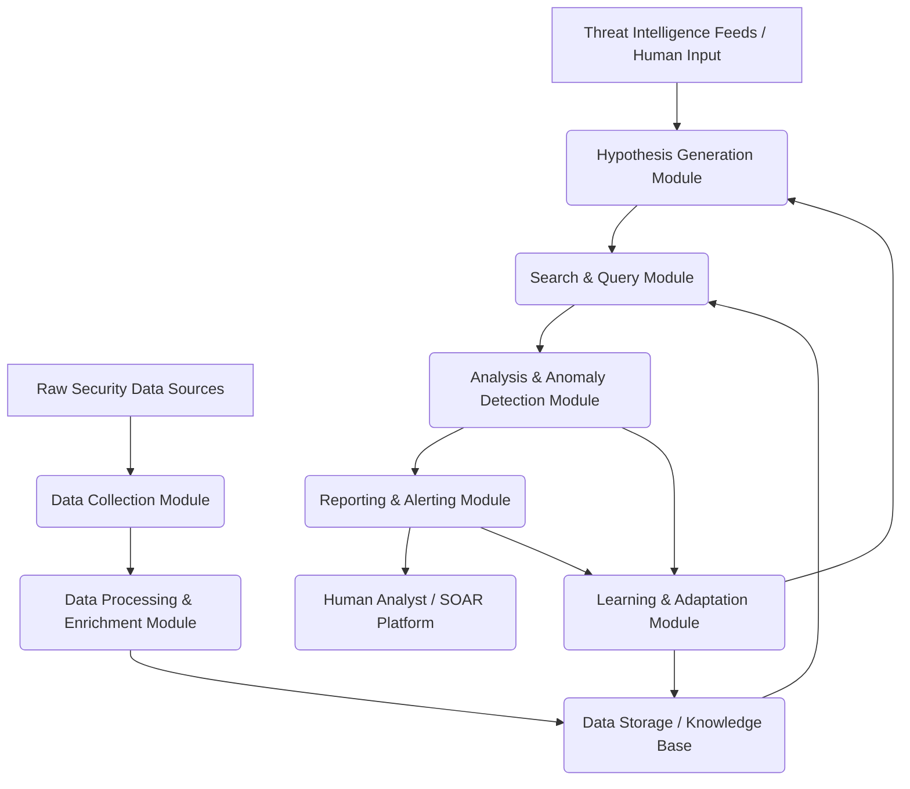

# THREAT HUNTER AGENTIC AI

Excellent! Let's architect our simple Agentic AI threat hunter using these broad actions. We'll outline the core modules, their responsibilities, and how they interact.

## Agentic AI Threat Hunter Architecture

At its core, our agent will operate in a continuous loop, perceiving its environment (data), reasoning about it, acting (querying/analyzing), and learning from the outcomes.

### Core Modules and Their Functions:

Let's break down each module based on the actions we defined:

#### 1. Data Collection Module (Perception)
* **Purpose:** To continuously ingest raw security data from various sources. This is the "eyes and ears" of our agent.
* **Inputs:**
    * Security Information and Event Management (SIEM) systems (e.g., Splunk, Elastic SIEM)
    * Endpoint Detection and Response (EDR) platforms (e.g., CrowdStrike, Microsoft Defender for Endpoint)
    * Network logs (NetFlow, firewall logs, proxy logs)
    * Cloud logs (AWS CloudTrail, Azure Activity Logs)
    * Directory services (Active Directory logs)
* **Mechanism:** API integrations, log forwarding, direct database connections, or specialized collectors.
* **Output:** Raw, often noisy, log events and telemetry data.

#### 2. Data Processing & Enrichment Module
* **Purpose:** To transform raw data into a structured, standardized, and more informative format, making it suitable for analysis.
* **Inputs:** Raw data from the Data Collection Module.
* **Mechanism:**
    * **Parsing:** Extracting key fields (source IP, destination IP, process name, command line, user, timestamp, event ID).
    * **Normalization:** Mapping diverse log formats into a common schema (e.g., all IPs go into a 'src_ip' field).
    * **Enrichment:**
        * **Geolocation:** Adding geographical context to IP addresses.
        * **Threat Intelligence Lookup:** Cross-referencing IPs, domains, hashes against known Indicators of Compromise (IOCs) from ingested threat feeds.
        * **Asset Context:** Adding information about the asset (e.g., criticality, owner, OS version) from an asset inventory.
        * **User Context:** Adding user details (e.g., department, role, usual login times) from identity management systems.
* **Output:** Cleaned, normalized, and enriched security events. This data is then typically stored in a high-performance data store (e.g., a data lake, a dedicated analytics database, or a SIEM's indexed data).

#### 3. Hypothesis Generation Module (Reasoning & Planning)
* **Purpose:** To formulate specific, testable hypotheses about potential threats that the agent will actively seek evidence for. This is where the agent decides *what* to hunt for.
* **Inputs:**
    * **Threat Intelligence Feeds:** New IOCs, TTPs, and threat actor profiles.
    * **MITRE ATT&CK Framework Knowledge Base:** A structured understanding of adversary tactics, techniques, and procedures.
    * **Previous Hunting Outcomes:** Feedback from the Learning & Adaptation Module (what worked, what didn't).
    * **Anomaly Detection Signals (from Analysis module):** Initial flags of unusual activity that warrant deeper investigation.
    * **Human Analyst Input:** Specific hunches or focus areas provided by security teams.
* **Mechanism:**
    * **Rule-based Logic:** Pre-defined hunting playbooks or templates (e.g., "Always hunt for lateral movement using PsExec after a high-severity alert").
    * **LLM (Large Language Model) Integration:** The LLM can interpret new threat intelligence, correlate it with known TTPs, and suggest novel hunting hypotheses in natural language, which are then translated into structured queries.
    * **Knowledge Graph/Semantic Reasoning:** Connecting disparate pieces of information (e.g., "If APT X uses technique Y, and we see IOC Z associated with Y, then hunt for Z.").
    * **Risk Scoring:** Prioritizing hypotheses based on potential impact and likelihood.
* **Output:** A prioritized list of specific hunting hypotheses, each translated into a structured query plan (e.g., "Search for processes spawned by svchost.exe on endpoints that recently had failed logins").

#### 4. Search & Query Module (Action / Tool Use)
* **Purpose:** To execute the generated hypotheses by querying the enriched security data store. This is how the agent "acts" upon its hypotheses.
* **Inputs:** Structured query plans from the Hypothesis Generation Module.
* **Mechanism:**
    * **SIEM Query Language:** Generating and executing queries in Splunk SPL, Elastic EQL, Kusto Query Language (KQL), etc.
    * **EDR Query API:** Querying endpoint telemetry for specific process, file, or network events.
    * **Database Queries:** SQL or NoSQL queries against dedicated security data lakes.
    * **Graph Database Queries:** For analyzing relationships between entities.
* **Output:** Raw search results from the data store, which could be millions of events, or a refined subset.

#### 5. Analysis & Anomaly Detection Module
* **Purpose:** To interpret the results of the queries, identify actual suspicious patterns or anomalies, and determine if a hypothesis is confirmed. This is a critical "reasoning" component.
* **Inputs:** Query results from the Search & Query Module.
* **Mechanism:**
    * **Pattern Matching:** Identifying known malicious sequences of events or specific indicators (e.g., an executable writing to a sensitive location and then making an outbound connection).
    * **Statistical Analysis:** Detecting deviations from established baselines (e.g., unusually high data transfer for a user, logins from atypical locations/times).
    * **Machine Learning Models:**
        * **Supervised Learning:** Classifiers trained on labeled datasets of malicious vs. benign activities.
        * **Unsupervised Learning:** Clustering algorithms to find groups of similar anomalous behaviors.
        * **Behavioral Analytics:** Models that learn normal user and entity behavior and flag deviations.
    * **Graph Analysis:** Identifying suspicious paths or central nodes in a graph of network connections or process trees.
    * **LLM (for Contextual Reasoning):** The LLM can be used to interpret complex event sequences, correlate multiple subtle indicators, and provide a narrative explanation for why certain findings are suspicious. It can also help distinguish between true positives and potential false positives by considering broader context.
* **Output:** Identified suspicious events, correlated findings, potential threats, and a confidence score for each finding, along with the evidence.

#### 6. Reporting & Alerting Module (Communication)
* **Purpose:** To communicate confirmed threats or highly suspicious findings in an actionable way to human analysts or other automated systems.
* **Inputs:** Confirmed threats/suspicious findings from the Analysis & Anomaly Detection Module.
* **Mechanism:**
    * **SIEM Alert Generation:** Creating new alerts within the SIEM, often with enriched context.
    * **Incident Ticket Creation:** Automatically opening tickets in an Incident Response or Service Management system (e.g., ServiceNow, Jira).
    * **Notification:** Sending emails, Slack messages, or PagerDuty alerts to security teams.
    * **SOAR Integration:** Triggering pre-defined security orchestration, automation, and response (SOAR) playbooks for automated containment or further investigation.
    * **Dashboard Updates:** Populating a threat hunting dashboard with findings.
    * **LLM (for Summarization):** Generating concise, human-readable summaries of the identified threat, its context, and recommended next steps.
* **Output:** Actionable alerts, tickets, and reports.

#### 7. Learning & Adaptation Module (Memory & Self-Improvement)
* **Purpose:** To enable the agent to improve its hunting capabilities over time by learning from its experiences and external feedback.
* **Inputs:**
    * **Human Feedback:** Analysts marking findings as true positive, false positive, or providing additional context.
    * **Hunting Outcome:** Whether a hypothesis was confirmed or debunked, and the severity of the findings.
    * **New Threat Intelligence:** Updated IOCs, TTPs, and adversary profiles.
* **Mechanism:**
    * **Feedback Loops:** Integrating human validation into the analysis and hypothesis generation.
    * **Model Retraining/Refinement:** Adjusting parameters or retraining ML models based on performance (e.g., reducing false positives, increasing true positives).
    * **Knowledge Base Update:** Adding new confirmed TTPs or successful hunting queries to its internal knowledge base.
    * **Hypothesis Prioritization Adjustment:** Learning which types of hypotheses yield the most valuable findings.
    * **Baseline Adjustment:** Continuously updating baselines for normal behavior based on environmental changes.
    * **LLM Fine-tuning/Contextual Learning:** Fine-tuning the LLM on specific security datasets and feedback to improve its reasoning and natural language generation in the security domain.
* **Output:** Improved hunting hypotheses, more accurate analysis models, and a continuously evolving understanding of the threat landscape and the monitored environment.

This architecture creates a powerful, autonomous, and continuously improving threat hunting AI agent that can significantly augment human security analysts. Now we can start to dive deeper into specific technologies or design choices for each module!
